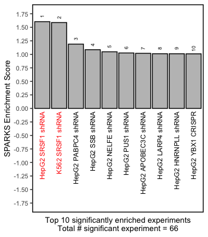

# SPARKS

## About

**S**plicing **P**rofile **A**nalysis using **R**BP **K**D/KO **S**ignatures (**SPARKS**) identifies the RBPs most responsible for AS changes in the study of interest, by comparing the AS changes from the study of interest to AS changes from RBP perturbation experiments.


## Table of contents

- [Dependencies](#dependencies)
- [Install](#install)
- [Snakemake pipeline for data processing](#Snakemake-pipeline-for-data-processing)
- [Shiny-app](#shiny-app)
- [Usage](#usage)
* [Examples](#examples)
* [rMATS output processing](#rMATS-output-processing)
- [Contacts and bug reports](#contacts-and-bug-reports)
- [Copyright and License Information](#copyright-and-license-information)

## Dependencies

SPARKS is written and packaged in R.

- R (>= v4.2.0)
* devtools
* maftools
* reshape2
* data.table
* pbmcapply
* dplyr
* RColorBrewer
* ggplot2

Python is required for processing rMATS output for SPARKS input.
- Python3 (>= v3.6.6)
* numpy 
* pandas 
* argparse

SPARKS provides a fully automated Snakemake analysis pipeline,
from fastq files to packaged end-result R object. 
To use this pipeline, these softwares are required: 
- [Snakemake](https://snakemake.readthedocs.io/en/stable/)
- [STAR](https://github.com/alexdobin/STAR)
- [rMATS-turbo](https://github.com/xinglab/rmats-turbo)
- [Kallisto](https://pachterlab.github.io/kallisto/) (required for expression quantification)

If the user doesn't want to re-process data, but rather use the core SPARKS analysis function, 
AS changes need to be quantified using [rMATS-turbo](https://github.com/xinglab/rmats-turbo), using two group mode. 

The reference AS signature library was generated using human reference genome in [GRCh37](https://ftp.ensembl.org/pub/grch37/current/fasta/homo_sapiens/dna/Homo_sapiens.GRCh37.dna.toplevel.fa.gz) 
and gene annotation file in gtf format ([v26lift37](https://ftp.ebi.ac.uk/pub/databases/gencode/Gencode_human/release_26/GRCh37_mapping/gencode.v26lift37.annotation.gtf.gz)). Thus, it is recommended to use these reference files to quantify AS changes in the study. 

The library of AS signatures from RBP perturbation experiments need to be downloaded. This library is generated from the public RBP perturbation data generated by [ENCODE consortium](https://www.encodeproject.org/encore-matrix/?type=Experiment&status=released&internal_tags=ENCORE). The library file, stored in RDS format, can be found [here](https://zenodo.org/record/7789657#.ZCc_2ezMITs)


## Install

SPARKS can be installed using devtools, directly from this github repository: 

```
devtools::install_github("xinglab/sparks")
```

## Snakemake pipeline for data processing 

SPARKS provides a fully automated Snakemake analysis pipeline,
from fastq files to packaged end-result R object. 

Detailed manual about this pipeline can be found [here](./README.snakemake_pipeline.md)

## Shiny-app

SPARKS provides Shiny app for users to run basic SPARKS analysis and visaulize in an interactive manner. Shiny app can run by running `./SPARKS_shiny/app.R` in your Rstudio.

## Usage

SPARKS requires AS changes quantified by rMATS between case vs. control samples. 

If the included snakemake pipeline was used, 
the `SPARKS.rds` file would contain all the necessary data, 
including expression and splicing data for each sample,
as well as SPARKS analysis result.

The SPARKS object can be imported as follows, in **R**:
``` 
library(SPARKS)  # load the SPARKS library 
library(data.table)  # load data.table for reading the input data 
library(dplyr)

# read in the packaged SPARKS object
input_sparks_file <- "YOUR_STUDY_NAME.SPARKS.rds"
input_sparks <- readRDS(input_sparks_file)

# define study name
input_study <- "YOUR_STUDY_NAME"
``` 

From the object, SPARKS analysis result can be accessed as follows. 
Note that SPARKS is designed for Skipped Exon (**SE**) events.
```
sparks_analysis_result <- input_sparks@SPARKS_analysis_result$SE
```

Otherwise, if the user wants to run SPARKS anaylsis on one's own, it can be run as follows: 
```
# read in the library 
signature_library_file <- "library/SPARKS_library.SE.rds"
signature_library <- readRDS(signature_library_file)

# import the data for analysis run
input_mats_df <- import_SPARKS_MATS_for_analysis(input_sparks, "SE") 

# perform SPARKS analysis
sparks_analysis_result <- perform_SPARKS_analysis_with_overlap_filter(input_mats_df,
  signature_library,
  input_study)
```

From the analysis result, top enrichment plots can be visualized as below: 
```
generate_enrichment_barplot(sparks_analysis_result,
                            num_plot = 10,  # plot top 10 based on abs ES
                            manual_colors = c("SRSF1" = "red") # denote SRSF1
                            )
```



Please note that RBP perturbation experiments with SRSF1 KD are noted in red text.


### Examples

Detailed examples on SPARKS analysis can be found below. The data for the examples below can be found [here](https://zenodo.org/record/7789657#.ZCc_8ezMITt). 
- [Basic SPARKS analysis on MCF7 SRSF1 KD data](example/MCF7_SRSF1_shRNA/MCF7_SRSF1_shRNA.SPARKS_example.md).
- [ESRP and ZEB1 analysis in EMT](example/EMT/EMT_analysis.md). This analysis demonstrates how you can add custom public RBP perturbation datasets into your SPARKS analysis. It also shows how you can utilize the expression values quantified by the Snakemake processing pipeline.

### rMATS output processing 

SPARKS uses modified MATS output as an input for the AS changes in the study of interest.

To use SPARKS, we need 4 files from rMATS, to process the count information for known AS events:
```
{spl_type}.MATS.JC.txt  # this file contains the information about count data
fromGTF.{spl_type}.txt  # this file contains event coordinate information for all events 
fromGTF.{spl_type}.novelJunction.txt  # this file contains event coordinate information for novel junction combination events
fromGTF.{spl_type}.novelSpliceSite.txt  # this file contains event coordinate information for novel splice site events 
```

From rMATS output, the MATS dataframe file can be generated using `import_raw_rMATS_output()` function 
as follows:
```
# import the rMATS output directly 
input_rmats_dir <- "/directory/to/rMATS/output"
input_mats_df <- import_raw_rMATS_output(input_rmats_dir, "SE")

```

With this input, SPARKS can be run, in R, as follows: 
```
library(SPARKS)  # load the SPARKS library 
library(data.table)  # load data.table for reading the input data 

# read in the library 
signature_library_file <- "/downloaded/signature/RDS/file.rds"
signature_library <- readRDS(signature_library_file)


# define study name
input_study <- "STUDY_OF_INTEREST"

# perform SPARKS analysis
sparks_analysis_result <- perform_SPARKS_analysis_with_overlap_filter(input_mats_df,
  signature_library,
  input_study)

sparks_analysis_result
```


## Contacts and bug reports

Harry Taegyun Yang
harry2416@gmail.com

Yi Xing
Yi.Xing@pennmedicine.upenn.edu

If you found a bug or mistake in this project, we would like to know about it.
Before you send us the bug report though, please check the following:

1. Are you using the latest version? The bug you found may already have been
fixed.
2. Check that your input is in the correct format and you have selected the
correct options.
3. Please reduce your input to the smallest possible size that still produces
the bug; we will need your input data to reproduce the problem, and the
smaller you can make it, the easier it will be.

## Copyright and License Information

Copyright (C) 2023 University of California, Los Angeles (UCLA), Children's Hospital of Philadelphia (CHOP)

Harry Taegyun Yang, Yi Xing

This program is free software: you can redistribute it and/or modify it under
the terms of the GNU General Public License as published by the Free Software
Foundation, either version 3 of the License, or (at your option) any later
version.

This program is distributed in the hope that it will be useful, but WITHOUT
ANY WARRANTY; without even the implied warranty of MERCHANTABILITY or FITNESS
FOR A PARTICULAR PURPOSE. See the GNU General Public License for more details.

You should have received a copy of the GNU General Public License along with
this program. If not, see http://www.gnu.org/licenses/.