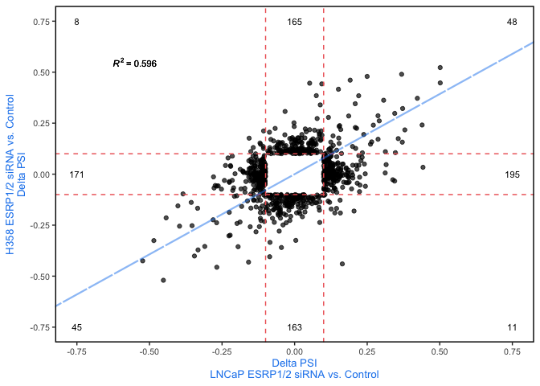
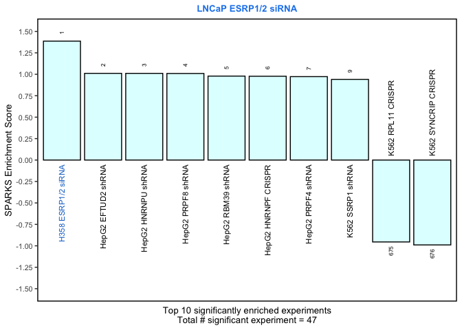
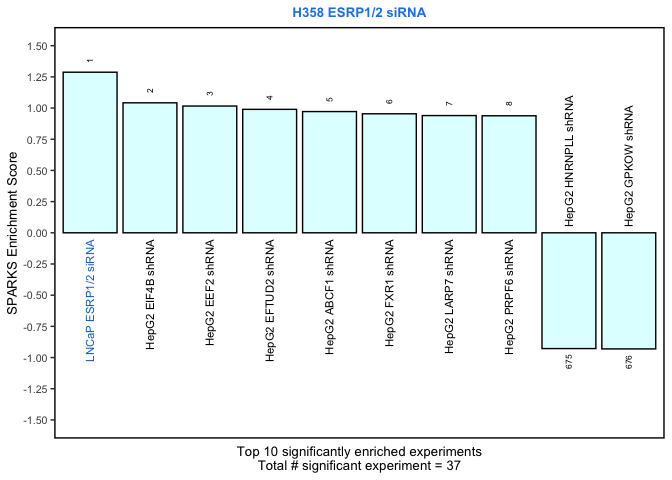
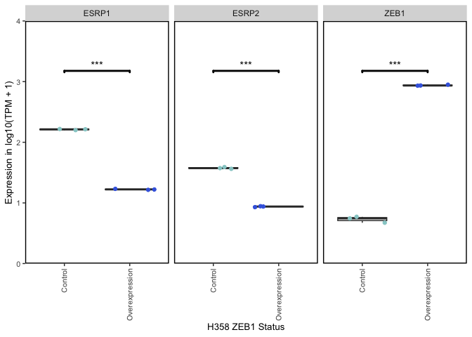
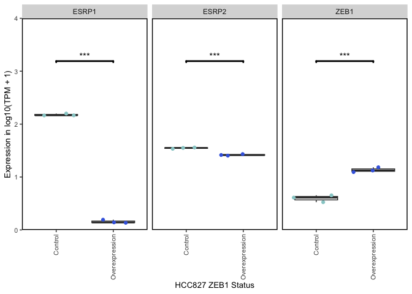
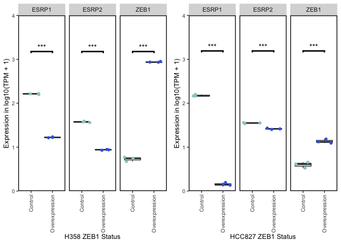
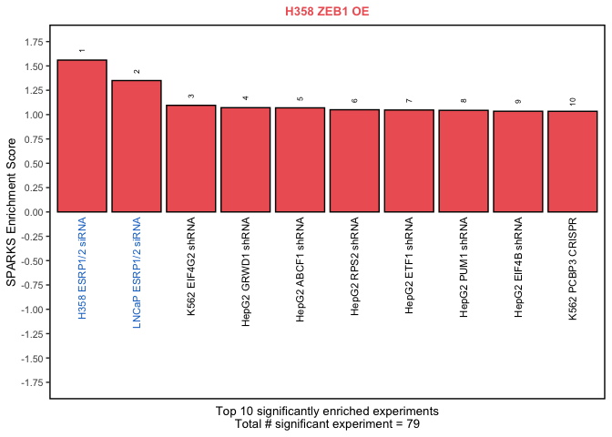
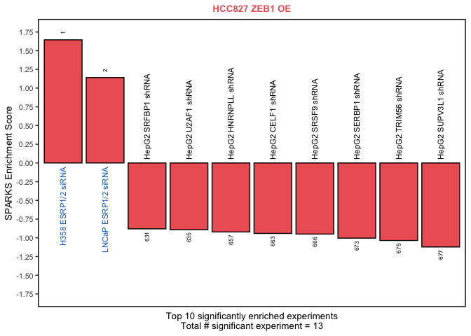

EMT Analysis
================
Harry Taegyun Yang
2023-03-31

## SPARKS example - Epithelial Mesenchymal Transition

This example demonstrates how to incorporate public RBP perturbation
RNA-Seq data set, by reproducing the validation experiment here that
SPARKS can recapitulate the ZEB1-ESRP1/2 regulatory axis during
Epithelial Mesenchymal Transition (**EMT**).

### ESRP1/2 Analysis

ESRP1/2 are key RBPs involved in maintaining epithelial splicing
programs in epithelial cells. During EMT, ZEB1 down-regulates the
expression of ESRP1/2 to repress epithelial splicing program.

ESRP1/2 are not perturbed by ENCODE consortium, so the AS changes from
their knockdown is not represented in the library. Thus, it is necessary
to utilize public RNA-Seq data from ESRP1/2 perturbation.

#### Importing public ESRP1/2 knockdown data sets

For this analysis, we utilized two ESRP1/2 perturbation data sets in two
different cell line - one in H358 ([Yang et al., MCB
2016](https://www.tandfonline.com/doi/full/10.1128/MCB.00019-16), GEO
Accession No. GSE75489) and another in LNCaP ([Munkley et al., eLife
2019](https://elifesciences.org/articles/47678), GEO Accession
No. GSE129540).

Raw reads from these data sets are downloaded and processed using SPARKS
Snakemake pipeline from alignment to SPARKS analysis using standard
ENCODE AS signature library.

The packaged SPARKS objects for those data sets can be imported as
follows:

``` r
library(SPARKS)  # load the SPARKS library 
library(data.table)  # load data.table for reading the input data 
library(dplyr)
```

    ## 
    ## Attaching package: 'dplyr'

    ## The following objects are masked from 'package:data.table':
    ## 
    ##     between, first, last

    ## The following objects are masked from 'package:stats':
    ## 
    ##     filter, lag

    ## The following objects are masked from 'package:base':
    ## 
    ##     intersect, setdiff, setequal, union

``` r
library(ggplot2)

# read in H358 ESRP1/2 siRNA data
h358_esrp_sparks_file <- 'data/H358_ESRP12_siRNA.SPARKS.rds'
h358_esrp_sparks <- readRDS(h358_esrp_sparks_file)

# read in LNCaP ESRP1/2 siRNA data
lncap_esrp_sparks_file <- 'data/LNCaP_ESRP12_siRNA.SPARKS.rds'
lncap_esrp_sparks <- readRDS(lncap_esrp_sparks_file)
```

#### Calculating correlation in AS between ESRP1/2 knockdown experiments

As a sanity check, we validate that ESRP1/2 perturbation in two
different cell lines lead to similar AS changes, by plotting scatter
plot of AS changes in between them.

You can use the same function to visualize correlations between AS
changes and qualitatively inspect them.

``` r
# import AS changes from each study
h358_esrp_mats <- import_SPARKS_MATS_for_analysis(h358_esrp_sparks, "SE")
lncap_esrp_mats <- import_SPARKS_MATS_for_analysis(lncap_esrp_sparks, "SE")

# generate scatter plot
generate_RBP_KD_correlation_scatter_plot(lncap_esrp_mats,
                                         h358_esrp_mats,
                                         "LNCaP ESRP1/2 siRNA vs. Control",
                                         "H358 ESRP1/2 siRNA vs. Control") +
  theme(axis.title  = element_text(color = "dodgerblue2"))
```

<!-- -->

As you can see, the $R^{2} = 0.596$ suggesting high correlation between
the AS changes from ESRP1/2 perturbation in those two cell lines.

#### Performing SPARKS analysis with custom library

While the provided SPARKS Snakemake pipeline performs SPARKS analysis
using standard ENCODE AS signature library, we need to run the same
analysis for the AS signatures from ESRP1/2 KD.

In this context, we calculate the enrichment score and p-value for the
ESRP1/2 signature from one experiment to another, and add it to the
pre-computed SPARKS analysis results. This will give us the quantitative
perspective on how similar the AS changes are when ESRP1/2 is perturbed
in the two different cell lines.

First, we perform this on H358 ESRP1/2 KD data

``` r
# read in the library 
signature_library_file <- "../../library/SPARKS.ENCODE_signatures.library.rds"
signature_library <- readRDS(signature_library_file)$SE  # keep the SE parts only for memory management

# import pre-calculated SPARKS results
h358_esrp_result <- h358_esrp_sparks@SPARKS_analysis_result$SE

# perform the new test and add it to the result 
h358_new_result <- 
  add_custom_library_to_SPARKS_test_result(h358_esrp_mats,
                                           h358_esrp_result,
                                           lncap_esrp_mats,
                                           "LNCaP_ESRP1/2_siRNA",
                                           signature_library)
```

    ## [1] "LNCaP_ESRP1/2_siRNA"
    ##      score pos_score  neg_score     pos_pval     neg_pval         pval
    ## 1 1.287312 0.6443882 -0.6429241 1.447962e-11 4.346123e-11 3.135022e-20

Then, we perform the same analysis on LNCaP ESRP1/2 KD data

``` r
# import pre-calculated SPARKS results
lncap_esrp_result <- lncap_esrp_sparks@SPARKS_analysis_result$SE

# perform the new test and add it to the result 
lncap_new_result <- 
  add_custom_library_to_SPARKS_test_result(lncap_esrp_mats,
                                           lncap_esrp_result,
                                           h358_esrp_mats,
                                           "H358_ESRP1/2_siRNA",
                                           signature_library)
```

    ## [1] "H358_ESRP1/2_siRNA"
    ##      score pos_score  neg_score     pos_pval     neg_pval         pval
    ## 1 1.386491  0.710777 -0.6757142 1.735174e-15 1.366865e-12 1.477745e-25

#### Visualizing the analysis results

We can show the top 10 perturbation experiments based on the
$|Enrichment Score|$ as follows. We noted the AS signatures from ESRP1/2
perturbation experiments in blue.

``` r
# generate bar plot
generate_enrichment_barplot(lncap_new_result,
                            bar_color = "lightcyan",  # set bar color 
                            num_plot = 10,  # plot top 10 
                            manual_colors = list("ESRP1/2" = "dodgerblue3")) + # denote ESRP1/2 perturbation data in blue 
  ggtitle("LNCaP ESRP1/2 siRNA") +  # add the plot title 
  theme(plot.title = element_text(size = 10,  # adjust the plot title 
                                  hjust = 0.5,
                                  face = "bold",
                                  color = "dodgerblue2"))
```

<!-- -->

``` r
generate_enrichment_barplot(h358_new_result,
                            bar_color = "lightcyan",
                            num_plot = 10,
                            manual_colors = list("ESRP1/2" = "dodgerblue3")) +
  ggtitle("H358 ESRP1/2 siRNA") +
  theme(plot.title = element_text(size = 10,
                                  hjust = 0.5,
                                  face = "bold",
                                  color = "dodgerblue2"))
```

<!-- -->

AS signature from ESRP1/2 perturbation is the most strongly enriched in
both cases, suggesting that SPARKS can pinpoint that ESRP1/2 is the
causal RBP for the AS changes when ESRP1/2 is perturbed.

### ZEB1 analysis

ZEB1 is a transcription factor upregulated during EMT process and
downregulates ESRPs to repress the epithelial splicing program. Here, we
demonstrate that we can recapitulate that ESRP downregulation is
responsible for the ZEB1-mediated changes.

#### Importing public ZEB1 over-expression data sets

For this analysis, we utilized two ZEB1 over-expression data sets in two
different cell line - one in H358 ([Yang et al., MCB
2016](https://www.tandfonline.com/doi/full/10.1128/MCB.00019-16), GEO
Accession No. GSE75489) and another in HCC827 ([Zhang et al., Nature
Communications 2016](https://www.nature.com/articles/ncomms12231), GEO
Accession No. GSE81167).

Raw reads from these data sets are downloaded and processed using SPARKS
Snakemake pipeline from alignment to SPARKS analysis using standard
ENCODE AS signature library.

The packaged SPARKS objects for those data sets can be imported as
follows:

``` r
# import SPARKS object for Yang data
yang_sparks <- readRDS('data/H358_ZEB1_OE.SPARKS.rds')
# import SPARKS object for Zhang data
zhang_sparks <- readRDS('data/HCC827_ZEB1_OE.SPARKS.rds')
```

#### Visualizing expression for genes of interest

ZEB1 directly downregulates ESRP1/2 expression. SPARKS Snakemake
pipeline also quantifies expression in TPM using Kallisto, and the
expression data is stored in there.

We will check if ZEB1 is over-expressed, and, subsequently, ESRP1/2 are
down-regulated. We will check this in Yang data first. This data set has
time-course data from day 0 (no Dox) to day 7, with Dox-inducible ZEB1.
We selected day 7 as ZEB1 OE, and day 0 as control.

``` r
# generate expression plot for ZEB1 and ESRP1/2
yang_exp_df <- query_expression_data_for_gene_set(yang_sparks, c("ESRP1", "ESRP2", "ZEB1"))

# reshape the data for plotting 
yang_exp_melt <- reshape2::melt(yang_exp_df)
```

    ## Using gene as id variables

``` r
# extract sample status
yang_exp_melt$status <- unlist(lapply(yang_exp_melt$variable, function(x) strsplit(as.character(x), "_")[[1]][2]))

# re-annotate status as treatment condition
yang_exp_melt$condition <- ifelse(yang_exp_melt$status == "No",  # No means no ZEB1 Over expression
                                  "Control",
                                  "Overexpression")

# generate plot 
p_yang_exp <- ggplot(yang_exp_melt,
                     aes(x = condition,
                         y = log10(value + 1))) +
  geom_boxplot() +
  geom_jitter(aes(color = condition)) +
  facet_grid(~ gene) +
  theme(axis.text.y   = element_text(size = 8),
        axis.text.x   = element_text(size = 8),
        axis.title.y  = element_text(size = 10),
        axis.title.x  = element_text(size = 10),
        panel.background = element_blank(),
        panel.grid.major = element_blank(),
        panel.grid.minor = element_blank(),
        panel.border = element_rect(color = "black",
                                    fill = NA,
                                    size = 1)
  )+
  ggsignif::geom_signif(comparisons = list(c("Control", "Overexpression")),
                        # map_signif_level = TRUE,
                        size = 1,
                        margin_top = 0.1,
                        test = "t.test",
                        tip_length = 0.01,
                        annotations = c("***")) +
  labs(x = "H358 ZEB1 Status",
       y = "Expression in log10(TPM + 1)") +
  theme(legend.position = "none") +
  scale_color_manual(values = c("Control" = "paleturquoise3",
                                "Overexpression" = "royalblue")) +
  scale_y_continuous(limits = c(0, 4),
                     expand = c(0, 0)) +
  theme(axis.text.x = element_text(angle = 90, hjust = 1,
                                   vjust = 0.5))
p_yang_exp
```

<!-- -->

We can perform the same steps to Zhang data.

``` r
# generate expression plot for ZEB1 and ESRP1
zhang_exp_df <- query_expression_data_for_gene_set(zhang_sparks, c("ESRP1", "ESRP2", "ZEB1"))

# reshape the data for plotting 
zhang_exp_melt <- reshape2::melt(zhang_exp_df)
```

    ## Using gene as id variables

``` r
# extract sample status
zhang_exp_melt$status <- unlist(lapply(zhang_exp_melt$variable, function(x) strsplit(as.character(x), "_")[[1]][2]))

# re-annotate status as treatment condition
zhang_exp_melt$condition <- ifelse(zhang_exp_melt$status == "Control",  # Control means no ZEB1 Over expression
                                   "Control",
                                   "Overexpression")

# generate plot 
p_zhang_exp <- ggplot(zhang_exp_melt,
                      aes(x = condition,
                          y = log10(value + 1))) +
  geom_boxplot() +
  geom_jitter(aes(color = condition)) +
  facet_grid(~ gene) +
  theme(axis.text.y   = element_text(size = 8),
        axis.text.x   = element_text(size = 8),
        axis.title.y  = element_text(size = 10),
        axis.title.x  = element_text(size = 10),
        panel.background = element_blank(),
        panel.grid.major = element_blank(),
        panel.grid.minor = element_blank(),
        panel.border = element_rect(color = "black",
                                    fill = NA,
                                    size = 1)
  )+
  ggsignif::geom_signif(comparisons = list(c("Control", "Overexpression")),
                        # map_signif_level = TRUE,
                        size = 1,
                        margin_top = 0.48,
                        test = "t.test",
                        tip_length = 0.01,
                        annotations = c("***")) +
  labs(x = "HCC827 ZEB1 Status",
       y = "Expression in log10(TPM + 1)") +
  theme(legend.position = "none") +
  scale_color_manual(values = c("Control" = "paleturquoise3",
                                "Overexpression" = "royalblue")) +
  scale_y_continuous(limits = c(0, 4),
                     expand = c(0, 0)) +
  theme(axis.text.x = element_text(angle = 90, hjust = 1,
                                   vjust = 0.5))
p_zhang_exp
```

<!-- -->

The combined plot is generated as follows:

``` r
cowplot::plot_grid(p_yang_exp, p_zhang_exp, align = "h", axis = "tb")
```

<!-- -->

In both cases, ZEB1 is over-expressed, as expected by the study designs,
and ESRP1/2 are both downregulated.

#### Performing SPARKS analysis with ESRP1/2 library

As shown above in the ESRP1/2 cases, we can add custom public RBP
perturbation data sets in SPARKS.

For Yang data:

``` r
# extract the AS profile
yang_mats <- import_SPARKS_MATS_for_analysis(yang_sparks, "SE")

# extract the pre-computed SPARKS result 
yang_result_basic <- yang_sparks@SPARKS_analysis_result$SE

# add the result from H358 ESRP1/2 KD 
yang_result_h358 <- 
  add_custom_library_to_SPARKS_test_result(yang_mats,
                                           yang_result_basic,
                                           h358_esrp_mats,
                                           "H358_ESRP1/2_siRNA",
                                           signature_library)
```

    ## [1] "H358_ESRP1/2_siRNA"
    ##      score pos_score  neg_score     pos_pval     neg_pval         pval
    ## 1 1.559812 0.7742766 -0.7855353 5.164253e-27 1.400682e-28 9.089838e-53

``` r
# add the result from LNCaP ESRP1/2 KD 
yang_result_esrp <- 
  add_custom_library_to_SPARKS_test_result(yang_mats,
                                           yang_result_h358,
                                           lncap_esrp_mats,
                                           "LNCaP_ESRP1/2_siRNA",
                                           signature_library)
```

    ## [1] "LNCaP_ESRP1/2_siRNA"
    ##      score pos_score  neg_score     pos_pval     neg_pval         pval
    ## 1 1.349597  0.669386 -0.6802112 2.378734e-14 8.024826e-13 1.149548e-24

The same steps are applied to Zhang data.

``` r
# extract the AS profile
zhang_mats <- import_SPARKS_MATS_for_analysis(zhang_sparks, "SE")

# extract the pre-computed SPARKS result 
zhang_result_basic <- zhang_sparks@SPARKS_analysis_result$SE

# add the result from H358 ESRP1/2 KD 
zhang_result_h358 <- 
  add_custom_library_to_SPARKS_test_result(zhang_mats,
                                           zhang_result_basic,
                                           h358_esrp_mats,
                                           "H358_ESRP1/2_siRNA",
                                           signature_library)
```

    ## [1] "H358_ESRP1/2_siRNA"
    ##      score pos_score  neg_score     pos_pval     neg_pval         pval
    ## 1 1.644992 0.8848173 -0.7601747 1.932383e-20 4.902006e-11 6.643267e-29

``` r
# add the result from LNCaP ESRP1/2 KD 
zhang_result_esrp <- 
  add_custom_library_to_SPARKS_test_result(zhang_mats,
                                           zhang_result_h358,
                                           lncap_esrp_mats,
                                           "LNCaP_ESRP1/2_siRNA",
                                           signature_library)
```

    ## [1] "LNCaP_ESRP1/2_siRNA"
    ##      score pos_score  neg_score     pos_pval    neg_pval         pval
    ## 1 1.140973 0.6381252 -0.5028475 4.590632e-05 0.007195114 5.259472e-06

#### Visualizing the analysis results

We can show the top 10 perturbation experiments based on the
$|Enrichment Score|$ as follows. We noted the AS signatures from ESRP1/2
perturbation experiments in blue.

``` r
generate_enrichment_barplot(yang_result_esrp,
                            bar_color = "indianred2",
                            num_plot = 10,
                            manual_colors = list("ESRP1/2" = "dodgerblue3")) +
  ggtitle("H358 ZEB1 OE") +
  theme(plot.title = element_text(size = 10,
                                  hjust = 0.5,
                                  face = "bold",
                                  color = "indianred2"))
```

<!-- -->

``` r
generate_enrichment_barplot(zhang_result_esrp,
                                           bar_color = "indianred2",
                                           num_plot = 10,
                            manual_colors = list("ESRP1/2" = "dodgerblue3")) +
  ggtitle("HCC827 ZEB1 OE") +
  theme(plot.title = element_text(size = 10,
                                  hjust = 0.5,
                                  face = "bold",
                                  color = "indianred2"))
```

<!-- -->

AS signatures from ESRP1/2 perturbation are the most strongly enriched
in both cases, suggesting that SPARKS can pinpoint that ESRP1/2 is the
causal RBP for the AS changes when ZEB1 is over-expressed.

Thus, we successfully demonstrated that SPARKS can pinpoint ESRP1/2 as
the key RBP for ZEB1-mediated AS changes, during EMT.
