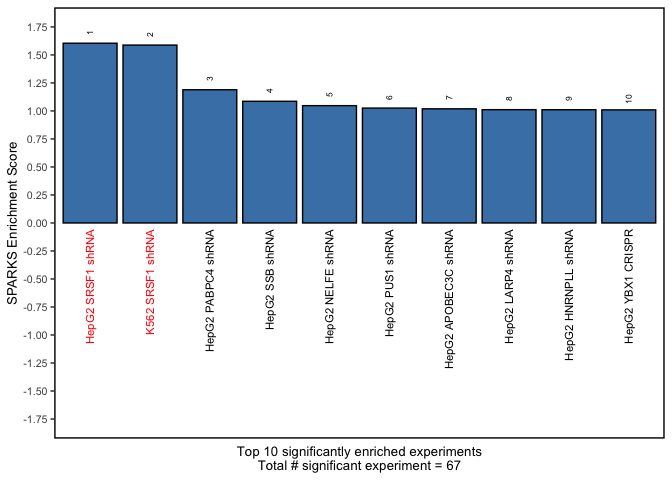

MCF7 SRSF1 Example
================
Harry Taegyun Yang
2023-03-31

## SPARKS example - MCF7 SRSF1 shRNA

This example shows how to run the core steps of SPARKS. SRSF1 shRNA KD
in MCF7 is chosen, as this cell line is not part of the reference
library, and the perturbed RBP is known (SRSF1). The data in this
example is generated by [Du et
al.](https://jeccr.biomedcentral.com/articles/10.1186/s13046-021-01978-8)
(Geo Accession No:
[GSE163025](https://www.ncbi.nlm.nih.gov/geo/query/acc.cgi?acc=GSE163025)).

### Running SPARKS analysis

#### Loading the necessary packages

``` r
library(SPARKS)  # load the SPARKS library 
library(data.table)  # load data.table for reading the input data 
library(dplyr)
```

    ## 
    ## Attaching package: 'dplyr'

    ## The following objects are masked from 'package:data.table':
    ## 
    ##     between, first, last

    ## The following objects are masked from 'package:stats':
    ## 
    ##     filter, lag

    ## The following objects are masked from 'package:base':
    ## 
    ##     intersect, setdiff, setequal, union

#### Loading the input data from MCF7 SRSF1 shRNA

SPARKS provides a fully automated analysis pipeline, from fastq files to
packaged end-result R object. We are using the packaged analysis data
here.

``` r
# read in the packaged SPARKS object
input_sparks_file <- "MCF7_SRSF1_shRNA.SPARKS.rds"
input_sparks <- readRDS(input_sparks_file)

# define study name
input_study <- "MCF7_SRSF1_shRNA"

# read in the input MATS
# - this function will only keep the known AS events, which is necessary
input_mats_df <- import_SPARKS_MATS_for_analysis(input_sparks, "SE") 
```

#### Loading pre-computed SPARKS analysis result

SPARKS snakemake pipeline automatically performs SPARKS analysis as the
final step. Thus, you can access the SPARKS analysis result directly
from the object.

``` r
sparks_analysis_result <- input_sparks@SPARKS_analysis_result$SE

head(sparks_analysis_result)
```

    ##                         S1               S2 correlation    rsquared
    ## value   HepG2_AGGF1_CRISPR MCF7_SRSF1_shRNA  0.09401635 0.002513888
    ## value1  HepG2_ANXA2_CRISPR MCF7_SRSF1_shRNA -0.20095213 0.017058459
    ## value2  HepG2_APEX1_CRISPR MCF7_SRSF1_shRNA -0.05855219 0.001206683
    ## value3  HepG2_BAZ1A_CRISPR MCF7_SRSF1_shRNA  0.07612498 0.001736834
    ## value4 HepG2_CD3EAP_CRISPR MCF7_SRSF1_shRNA  0.06273424 0.001688817
    ## value5  HepG2_CDC40_CRISPR MCF7_SRSF1_shRNA  0.08890398 0.003423338
    ##        num_common_events num_S1_events num_S2_events num_pos_pos num_neg_neg
    ## value               7809            76           960           3          12
    ## value1              8695           495          1248          28          52
    ## value2             11023           459          1635          33          58
    ## value3             13104           281          1957          36          33
    ## value4             12594           348          1868          24          51
    ## value5              5756           337           788          27          38
    ##        num_pos_neg num_neg_pos num_not_pos num_not_neg num_pos_not num_neg_not
    ## value            6           8         468         463          20          27
    ## value1          40          61         530         537         133         181
    ## value2          34          60         718         732         136         138
    ## value3          28          38         904         918          80          66
    ## value4          39          30         878         846         101         103
    ## value5          28          27         329         339         108         109
    ##        num_eff num_total_sig         score    score_abs       pval
    ## value        1          1007  2.496413e-06 2.496413e-06 0.79246025
    ## value1     -21          1562 -2.293391e-04 2.293391e-04 0.07885061
    ## value2      -3          1909 -1.896306e-06 1.896306e-06 0.63785318
    ## value3       3          2103  2.477652e-06 2.477652e-06 0.62999265
    ## value4       6          2072  4.890396e-06 4.890396e-06 0.62358465
    ## value5      10          1005  3.406306e-05 3.406306e-05 0.52381999
    ##          concordance concordance_abs concordance_pval gsea_pos_score
    ## value   0.0009930487    0.0009930487       0.74276270     -0.4161372
    ## value1 -0.0134443022    0.0134443022       0.01210397     -0.4422004
    ## value2 -0.0015715034    0.0015715034       0.71202680     -0.3601788
    ## value3  0.0014265335    0.0014265335       0.64193616      0.4387032
    ## value4  0.0028957529    0.0028957529       0.40167120     -0.4092246
    ## value5  0.0099502488    0.0099502488       0.14031043      0.3383294
    ##        gsea_neg_score gsea_pos_pval gsea_neg_pval  gsea_score gsea_score_abs
    ## value      -0.4632811   0.526819923   0.246000000  0.04714394     0.04714394
    ## value1      0.3650224   0.009148191   0.131332083 -0.80722273     0.80722273
    ## value2      0.3598391   0.179487179   0.160744501 -0.72001786     0.72001786
    ## value3      0.4218066   0.053435115   0.109195402  0.01689662     0.01689662
    ## value4     -0.4660139   0.088992974   0.002915329  0.05678933     0.05678933
    ## value5     -0.4401450   0.494252874   0.009811347  0.77847437     0.77847437
    ##        gsea_combined_pval gsea_pos_score_full gsea_neg_score_full
    ## value         0.394407306          -0.4719410          -0.4679998
    ## value1        0.009280278          -0.4356662           0.3409519
    ## value2        0.131147458          -0.3791310          -0.3624986
    ## value3        0.035848871           0.4285671           0.4077602
    ## value4        0.002401663          -0.3997520          -0.4476802
    ## value5        0.030690764           0.3286288          -0.4573254
    ##        gsea_score_full gsea_score_abs_full gsea_combined_pval_full rank
    ## value     -0.003941202         0.003941202             0.160074347  507
    ## value1    -0.776618160         0.776618160             0.013019248  181
    ## value2    -0.016632414         0.016632414             0.043244333  352
    ## value3     0.020806823         0.020806823             0.060528576  607
    ## value4     0.047928139         0.047928139             0.006379869  486
    ## value5     0.785954215         0.785954215             0.017781257  250
    ##        plot_score frequency_cutoff
    ## value  0.04714394              0.3
    ## value1 0.80722273              0.3
    ## value2 0.72001786              0.3
    ## value3 0.01689662              0.3
    ## value4 0.05678933              0.3
    ## value5 0.77847437              0.3

#### Performing SPARKS analysis

While the SPARKS object for the study has the SPARKS analysis result
stored, we demonstrate the usage of SPARKS analysis functions here.

SPARKS library needs to be loaded to run SPARKS analysis.

Please note that SPARKS analysis can be computationally intensive, and
might take up to 30 minutes to run.

``` r
# read in the library 
signature_library_file <- "../../library/SPARKS.ENCODE_signatures.library.rds"
signature_library <- readRDS(signature_library_file)$SE  # keep the SE parts only for memory management

# perform SPARKS analysis
sparks_analysis_result <- perform_SPARKS_analysis_with_overlap_filter(input_mats_df,
  signature_library,
  input_study)

head(sparks_analysis_result)
```

#### Visualize SPARKS analysis results

SPARKS analysis results can be visualized using
`generate_enrichment_barplot()` function. As we know SRSF1 is the RBP
responsible for the AS change in this data set, we will denote RBP
perturbation experiments with SRSF1 KD in red.

``` r
library(ggplot2)
generate_enrichment_barplot(sparks_analysis_result,
                            bar_color = "steelblue",  # set the bar color
                            num_plot = 10,  # plot top 10 based on abs ES
                            manual_colors = c("SRSF1" = "red")  # denote SRSF1
                            )
```

<!-- -->
